class: hide_logo center middle
<script src="https://kit.fontawesome.com/994a28441d.js" crossorigin="anonymous"></script>
```{r setup, include=FALSE}
options(htmltools.dir.version = FALSE,
        htmltools.preserve.raw = FALSE)
knitr::opts_chunk$set(
  fig.width=9, fig.height=3.5, fig.retina=3,
  out.width = "100%",
  cache = FALSE,
  echo = TRUE,
  message = FALSE, 
  warning = FALSE,
  hiline = TRUE
)
```

```{r, echo = F}
library(xaringanthemer)

extra_css <- 
  list(
    ".cit"  = list("font-size" = "50%",
                   "color" = "#8cd000"),
    ".phg" = list("color" = "#8cd000"),
    ".em05" = list("font-size" ="0.5em"),
    ".em06" = list("font-size" ="0.6em"),
    ".em07" = list("font-size" ="0.7em"),
    ".em08" = list("font-size" ="0.8em"),
    ".em09" = list("font-size" ="0.9em"),
    ".em11" = list("font-size" ="1.1em"),
    ".em12" = list("font-size" ="1.2em"),
    ".em13" = list("font-size" ="1.3em"),
    ".em14" = list("font-size" ="1.4em"),
    ".em15" = list("font-size" ="1.5em"),
    ".large" = list("font-size" = "160%"))

style_mono_accent_inverse(
  base_color = "#8cd000",
  white_color = "#FFFFFF",
  black_color = "#272822",
  extra_css = extra_css)

library(xaringanExtra)
use_logo(
  image_url = "https://apps.samuel-merk.de/data/PHK_2018_Logo_V1_FARBE_NUR_PH.svg",
  width = "80px",
  position = xaringanExtra::css_position(top = "1em", right = "1em")
)

```


# .white[Digital gestützter Unterricht:]

.em14[`r fontawesome::fa("tablet-alt", fill = "#ffff", height = "150px")` ]

### .white[Alter Wein in neuen Schläuchen - oder echte Innovation?]

 &nbsp;&nbsp;&nbsp;&nbsp;
 

---  
.em14[.white[Samuel Merk | PH Karlsruhe]]  
Folien: bit.ly/merk038

???
Sehr geehrte Frau Schultheis, sehr geehrte Mitglieder der Berfufungskommission, liebe Studierende!
* Zunächst einmal möchte ich mich natürlich ganz herzlich für die Einladung zu diesem Hearing bedanken und im rahemn... meine Ideen für Forschugn & Lehre in der Schulpädagogik zur Diskussion zu stellen ... 
* Ich habe mich bemüht einen Vortrag zu gestalten, in dem ich nicht en Detail über ein aktuelles Forschungsprojekt berichte - wie es typisch - für einen Konferenzbeitrag wäre
    *  Ich dachte mir vielmehr, dass es einem  gegenseitigen Kennenlernen besser dienlich, wenn ich eher grundlegend zu einem Thema spreche und dies um einen kurzen EInblick in Forshcungsprojekt ergänze
    * Als dieses Thema habe ich den Einsatz von digitalen Technolgoien im Schulalltag gewählt, zum einen, weil das in den letzten Jahren ein zentrales Thema ... zum amderen weil es der AUschreibung nach ein zentrales Arbeitsgebiet des zu bestezenden Lehrstuhls werden soll


---
name: outline
class: center, middle

# Überblick 

--
.large[.phgreenlight[`r fontawesome::fa("exclamation", fill = "#62DC3A")` These:] _Weder Substitution noch Disruption - eher Transformation_]  
&nbsp;  

--
.large[.phgreenlight[`r fontawesome::fa("drafting-compass", fill = "#62DC3A")` Grundsätzliches:] _Woher kommt das Potential digitaler Technologien?_ ]  
&nbsp;  

--
.large[Aktuelle Beispiele aus der .phgreenlight[`r fontawesome::fa("microscope", fill = "#62DC3A")` Forschung:] _Digitales Formatives Assessment_]  
&nbsp;  

---
class: center, middle, hide_logo
background-image: url(https://imagizer.imageshack.com/img924/1061/buQNhG.png)
background-size: cover
## .phgreenlight[`r fontawesome::fa("exclamation", fill = "#62DC3A")` These:] _Weder Substitution noch Disruption_  

---
# Substitution?
> .large[»Ich sehe die Gefahr, dass herkömmliche Inhalte und Lernformen mit ein paar digitalen Tools und moderner Technik nur neu verpackt werden«]  

--
&nbsp;  

> .large[»Einfach nur Computer in die Klasse zu stellen bringt nichts!«]  

--
&nbsp;   

> .large[»Lieber George Orwell, ein Update für „Thought Crime“ ist verfügbar. Wollen Sie es installieren?«]

---
# Disruption?
> .large[ »Educational technology is life-changing for students and encouraging for teachers«]

--
&nbsp;  

> .large[»Tablets have really revolutionized learning in the classroom«]

--
&nbsp;   

> .large[»No doubt, technology has brought a huge advancement and ease in learning«]


---
# These 
### Digitale Technologien in Schule und Untericht ...

--
<center> .em13[**... sind nicht notwendig:**]  

$\neg \text{dig. Technologien} \nRightarrow \neg \text{Lernerfolg}$  


--
.em13[**... sind nicht hinreichend:**]  

$\text{dig. Technologien} \nRightarrow \text{Lernerfolg}$  


--
.em13[**... haben spezifisches Potential:**]  

$\text{dig. Technologien + A + B + ...} \Rightarrow \text{Lernerfolg}$  


--
</center>
&nbsp;  
.em13[**... _können_ also Unterricht _transformieren_.**]


---

class: center, middle, hide_logo
background-image: url(https://imagizer.imageshack.com/img924/1061/buQNhG.png)
background-size: cover
## .phgreenlight[`r fontawesome::fa("drafting-compass", fill = "#62DC3A", height = "100px")` <br>&nbsp;<br>&nbsp;Grundsätzliches: <br>_Woher kommt das Potential?_] 

---

# Woher kommt dieses Potential?
### Dig. Technologien erlauben eine Anreicherung .cit[(Scheiter, Hoch & Drewes, in Vorb.)]
.em13[
* Multimedialität 
* Multiperspektivität
* Dynamik
* (Echtzeit-)Interaktivität]

### Potential ist der Technologie jedoch nicht inhärent .cit[(Bez, Tomasik & Merk, 2022)]
.em13[
* Anreicherung entsteht durch Passung von didaktischem Szenario und Technologie
* Dadurch ist der Technologieeinsatz keine hinreichende Bedingung für Unterrichtsqualität/Lernerfolg
]

???
Die Tübingen Kollegin Katharina Scheiter begründet dieser Potential mit den folgenden vier Charakteristika: 
* Multimedialität --> Die ist z.B. schon gegeben, wenn eine Lehkraft eine Teilchen-Animation eines chem. Prozesses zeigt und simultation dazu mündlich erklärt.
* Multiperspektivität -->  Hier wäre etwa klassisch der switch von der Satellitenansicht zur Kartenansicht in OpenStreetMaps oder googleEarth
* Dynamik --> Veränderungsprozesse leicht encodierbar. Klassische Geometrie / dynamische Geometrie
* Interaktivität --> Hier fallen uns vielleicht allen zunächst interaktive Karten mit Covid STatistiken ein, in die man reinzommen kann etc.

---

# Das SAMR-Modell .cit[(Puentedura, 2006)]

--

## .phgreenlight[S]ubstitution
### &nbsp;
.center[
`r fontawesome::fa("file-alt", fill = "#62DC3A", height = "150px")` &nbsp; &nbsp; &nbsp;&nbsp; &nbsp;
`r fontawesome::fa("arrow-right", fill = "#62DC3A", height = "150px")` &nbsp; &nbsp;&nbsp; &nbsp;&nbsp; &nbsp;
`r fontawesome::fa("tablet-alt", fill = "#62DC3A", height = "150px")` 
]


---

# Substitution beim Textlesen

## .phgreenlight[Bestenfalls Nulleffekte] .cit[(Delgado et al., 2018)]
.large[
* Metaanalyse mit $n = 44$ Studien; $N =171.055$ Teilnehmerinnen und Teilnehmern
* Kleine Effekte zu ungusten digitalen Lesens (Hedge's $g = −0.21$; Cohen's $U_3 = .58$ ).
]

---
class: center, middle, hide_logo
background-image: url(https://imagizer.imageshack.com/img924/1061/buQNhG.png)
background-size: cover

```{r, echo = F, message=FALSE, warning=FALSE, out.width="95%", dev = "svg", fig.height=4}
library(tidyverse)
library(ggdist)
library(hrbrthemes)
set.seed(725)  #725 --> d = .26

data_d02 <- 
  tibble(digital = round(rnorm(100, 27.8, 10), 0),
          analog =  round(rnorm(100, 30, 10), 0)) %>% 
         gather(Medium, `Richtige Antworten`)

#effsize::cohen.d(`Richtige Antworten` ~ Medium, data = data_d02)
#qnorm(effsize::VD.A(`Richtige Antworten` ~ Medium, data = data_d02)$estimate)*sqrt(2)

ggplot(data_d02,
       aes(`Richtige Antworten`, Medium, 
           fill = stat(x > data_d02 %>% 
                   filter(Medium == "analog") %>% 
                   pull(`Richtige Antworten`) %>% 
                   mean()))) + 
  stat_slab(quantiles = 100, alpha = .5) +
  stat_dots(aes(color = stat(x > data_d02 %>% 
                   filter(Medium == "analog") %>% 
                   pull(`Richtige Antworten`) %>% 
                   mean()))) +
  stat_pointinterval(color = "white", point_interval = mean_qi) +
  # geom_vline(aes(`Richtige Antworten`, Medium, 
  #               xintercept = data_d02 %>% 
  #                 filter(Medium == "analog") %>% 
  #                 pull(`Richtige Antworten`) %>% 
  #                 mean()), color = "white") + 
  scale_fill_manual(values = c("#50B32E", "#b0e69e")) + 
  scale_color_manual(values = c("#50B32E", "#b0e69e")) + 
  #annotate("text", x = 23, y = 2.3, label = "58%", color = "white", family="sans", size = 5) +
  theme_modern_rc()+
  theme(legend.position = "none") #+
  #coord_cartesian(xlim=c(0,75))


```


---

# Substitution beim Textlesen

## .phgreenlight[Bestenfalls Nulleffekte] .cit[(Delgado et al., 2018)]
.large[
* Metaanalsyse mit $n = 44$ Studien; $N =171055$ Teilnehmerinnen und Teilnehmern
* Kleine Effekte zu ungusten digitalen Lesens (Hedge's $g = −0.21$; Cohen's $U_3 = .42$ ).
* Moderatoren: Zeitbeschränkung, Textgenre, Publikationsjahr
]


---

# Das SAMR-Modell .cit[(Puentedura, 2006)]

## .phgreenlight[A]ugmentation
### &nbsp;
.center[
`r fontawesome::fa("chalkboard-teacher", fill = "#62DC3A", height = "150px")` &nbsp; &nbsp; &nbsp;&nbsp; &nbsp;
`r fontawesome::fa("arrow-right", fill = "#62DC3A", height = "150px")` &nbsp; &nbsp;&nbsp; &nbsp;&nbsp; &nbsp;
`r fontawesome::fa("play-circle", fill = "#62DC3A", height = "150px")` 
]

---

# Das SAMR-Modell .cit[(Puentedura, 2006)]

## .phgreenlight[M]odification
.pull-left[
```{r, echo = F, fig.cap="https://youtu.be/N9L00NLoDFg"}
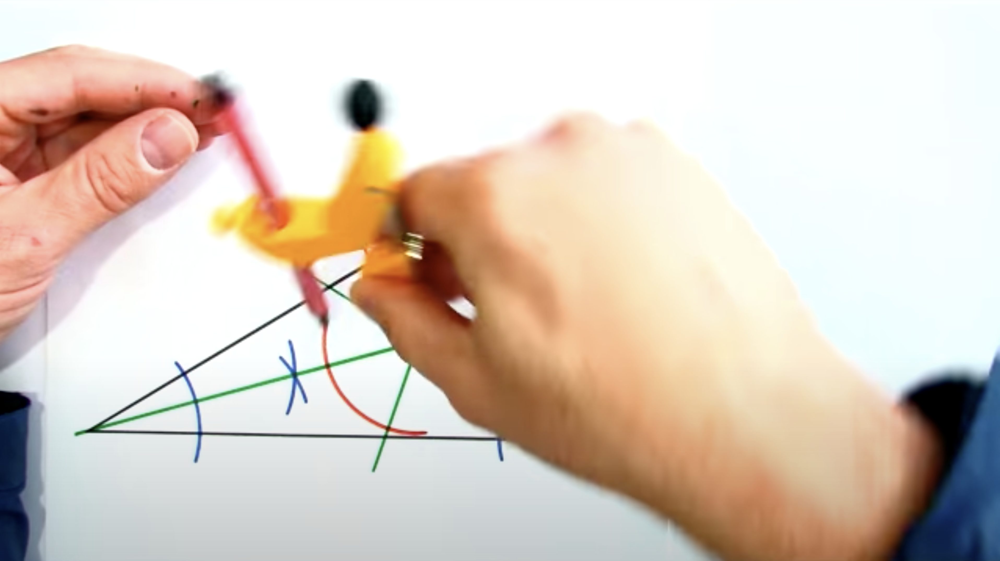
```
]

.pull-right[
<center>
<iframe id="geogebraframe2" src="https://www.geogebra.org/material/iframe/id/tygqhnr4/width/500/height/350/border/888888/rc/false/ai/false/sdz/false/smb/false/stb/false/stbh/false/ld/false/sri/false" allowfullscreen="" mozallowfullscreen="" webkitallowfullscreen="" id="iframe_container" frameborder="0" ></iframe>
</center>
<style>
#geogebraframe2 { height: 350px; width: 500px; margin-top: 0.0cm; border:0px;}
</style> 
]

---

# Mod. mit dyn. Visualisierungen

## .phgreenlight[Wirksam, falls nicht  »decorative«] 

.large[
* Hochwirksam für »motor-procedural knowledge« $U_3 = .85$ .cit[(Höffler & Leutner, 2007)]]
.center[
```{r, echo = F, out.width="30%"}
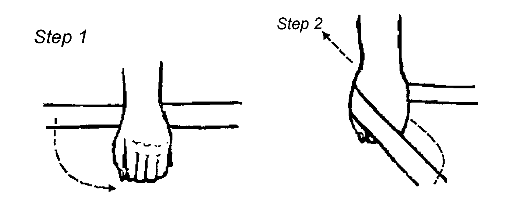
```
  
.cit[(Michas & Berry, 2000)]]

--

.large[
* Interaktion mit Modalitätseffekten $U_3 = .58$ vs. $U_3 = .81$]

---

# Das SAMR-Modell .cit[(Puentedura, 2006)]

## .phgreenlight[R]edefition
.center[
```{r, echo = F, fig.cap="https://youtu.be/7--hFxeI2JU", out.width="55%"}
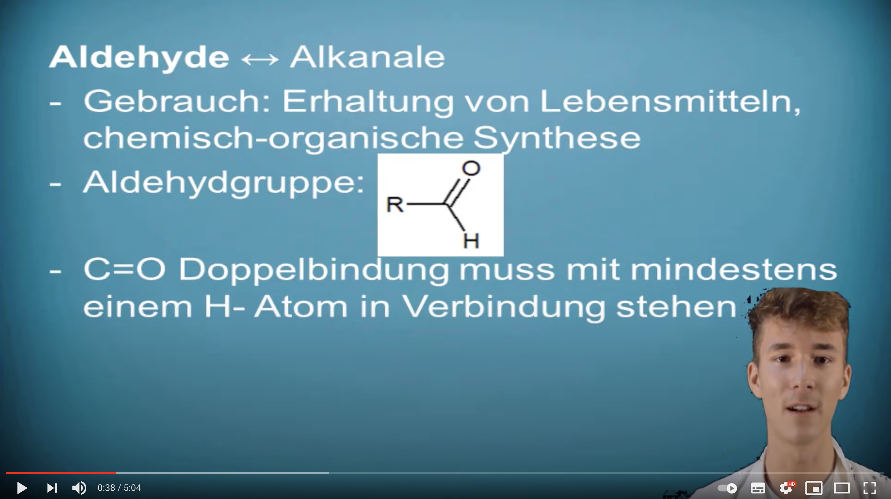
```
]

---
class: center, middle, hide_logo
background-image: url(https://imagizer.imageshack.com/img924/1061/buQNhG.png)
background-size: cover
# Aktuelle Beispiele aus eigener .phgreenlight[`r fontawesome::fa("microscope", fill = "#62DC3A")` Forschung:] _Digitales Formatives Assessment_

???
Ja, ich denke bis hierher ist ganz gut klargeworden, was ich mit der These "weder Alter Wei noch Revolution" meine und mit welcher Lizteratur ich sie begründe.  
Jetzt möchte ich illustrieren was das m.E. für Forschung implizieren.


---
class: hide_logo
## Digitales Formatives Assessment
### Ausgangslage
.em13[
* Feedback gilt als vergleichweise stark lernförderliche Intervention .cit[(Black & Wiliam, 2009)]
* Formatives Assessment wird jedoch kaum von Lehrkräften umgesetzt .cit[(Maier, 2019)]
* Digitalen Technologien wird Potential zugeschrieben, die Hürden für formatives Assessment zu senken .cit[(Tomasik et al., 2018)]]
--
.pull-left[
.center[
&nbsp;<br>
#### Sowohl Substitution...
`r fontawesome::fa("file-alt", fill = "#62DC3A", height = "100px")` &nbsp; &nbsp; &nbsp;&nbsp; &nbsp;
`r fontawesome::fa("arrow-right", fill = "#62DC3A", height = "100px")` &nbsp; &nbsp;&nbsp; &nbsp;&nbsp; &nbsp;
`r fontawesome::fa("tablet-alt", fill = "#62DC3A", height = "100px")` 
]
]
.pull-right[
.center[
&nbsp;<br>
#### ... als auch Transformation
```{r, echo = F, fig.cap="molview.org", out.width="35%"}
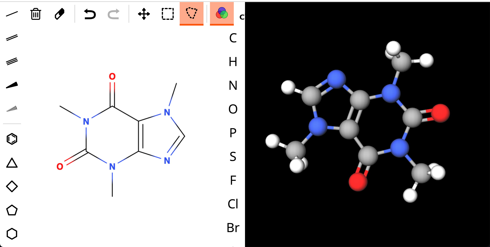
```
]
]

??? 
warum Digitales Form Assessment beforschen?
---
class: middle, center

```{r, echo = F, fig.cap="Projektablauf: »Vom Testergebnis zur pädagogischen Maßnahme« (Biaesch Stiftung"}
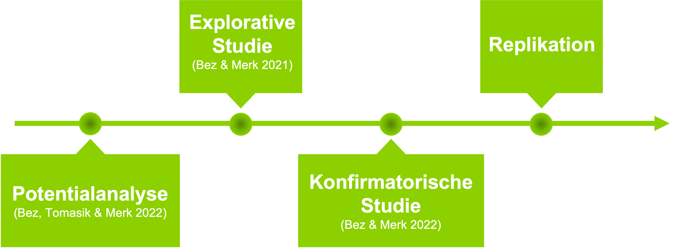
```

---
class: middle, center

```{r, echo = F, fig.cap="Projektablauf: »Vom Testergebnis zur pädagogischen Maßnahme« (Biaesch Stiftung"}
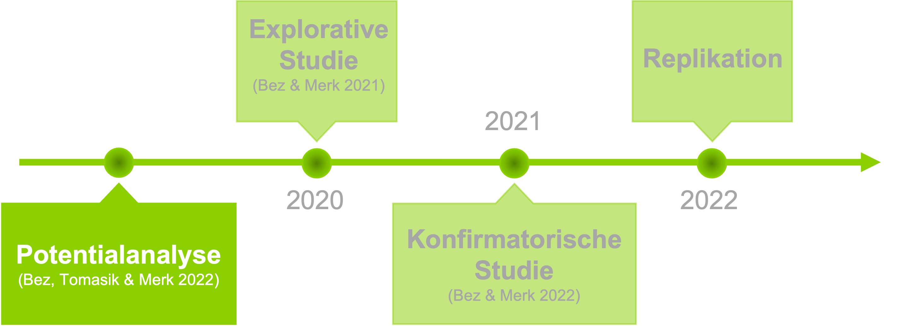
```


---
class: hide_logo
## Potentiale dig. Technologien für Formatives Assessment .cit[(Bez, Merk & Tomasik 2021)]
.em14[
* Redefinierte Aufgabenformen 
* Automatisierte Korrektur und unmittelbares Feedback (auch jenseits geschlossener Aufgabenformate)
* Digitale »Aufgabenpools«
    * Interaktive Suche entlang diverser Kriterien
    * Kalibrierte Aufgabenschwierigkeit
* Adaptive Aufgabenauswahl
* Echtzeitergebnisübersicht
* ...]

--

.large[.center[.phg[
$\Rightarrow$ Neue, komplexe Anforderungen an das professionelle Handeln
]]]

---
class: middle, center

```{r, echo = F, fig.cap="Projektablauf: »Vom Testergebnis zur pädagogischen Maßnahme« (Biaesch Stiftung"}
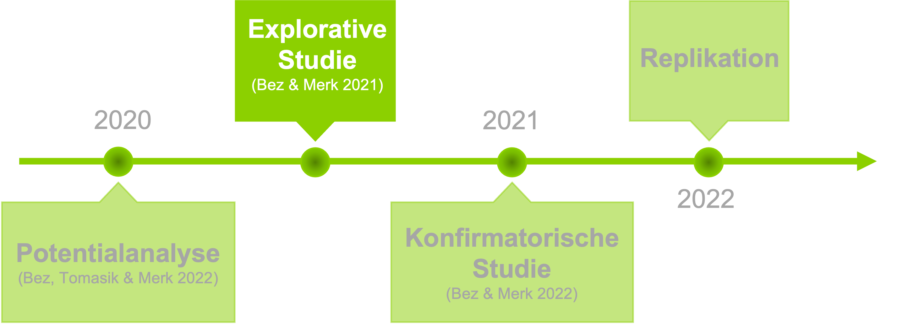
```

---
## Explorative Think-Aloud-Studie
.pull-left[
### Formatives Assessmentsystem
```{r, echo = F, fig.cap="mindsteps.ch", out.width="80%", fig.align='center'}
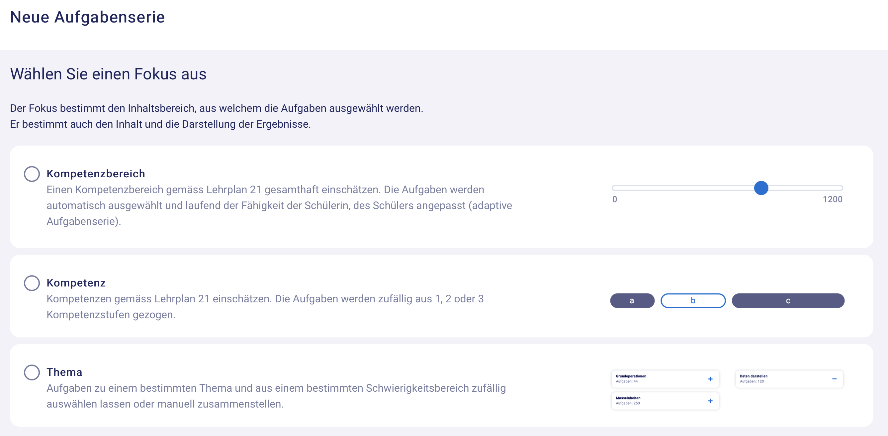
```
]

.pull-right[
### Stichprobe:
* Theoretisches/gezieltes Sampling (Patton 1990)
* $N = 48$ Intensivnutzer\*innen von Mindsteps 
* $N_{weiblich} = 23$
* $MW_{Alter} = 43.7$
* $SD_{Alter} = 11.5$)
]

---
class: hide_logo middle

```{r, echo = F, fig.cap="mindsteps.ch", out.width="71%", fig.align='center'}
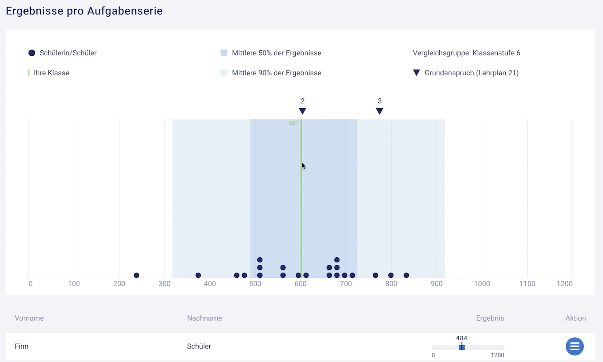
```


---
class: hide_logo middle

```{r, echo = F, fig.cap="mindsteps.ch", out.width="60%", fig.align='center'}
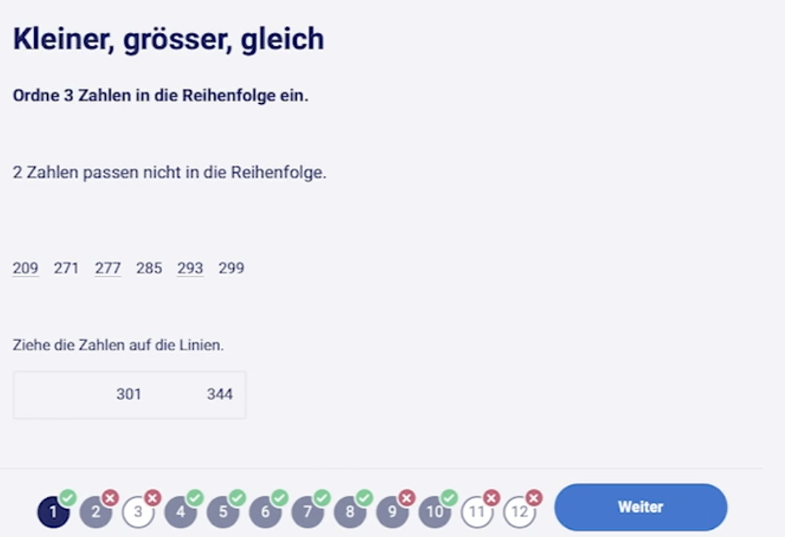
```


---
## Auswertung
Induktiv-Deduktives Timed-Event Coding der Screencasts entlang eines Modells von Coburn & Turner .cit[(2011)]

.pull-left[
1. <b>Noticing</b>
    * Rezeption der Grafiken
        * *Verteilungsform*
        * *Zentrale Tendenz*
        * *Dispersion*
        * *Einzelne Schülerinnen und Schüler*
2. <b>Interpreting</b>
    * Abgleich mit der eigenen Einschätzung
    * Fehleranalyse
        * *Curriculare Subcomponenten*
        * *Aufgabenformatartefakte*
3. <b>Constructing Implications</b>
    * Curriculare Adaption
    * Einzelförderung
    * Gruppeneinteilung
]

--

.pull-right[
### Interraterreliabilität
* Krippendorffs $.51 ≤ \alpha ≤ .95$ .cit[(Hayes & Krippendorff, 2007)]
* Überführung von Abweichungen in Konsensurteile

### Verlaufsanalyse
* Zero-/First-Order (manifest) Marcov Chains .cit[(Scholz, 2016)]
    * Auszählung (bedingter) relativer Übergangswahrscheinlichkeiten
]

---

### .phgreenlight[Hypothese: Fehleranalyse ist zentral] .cit[(Bez & Merk, 2021)]

```{r, echo=FALSE}
library(visNetwork)
library(readxl)
nodes <- data.frame(id = 1:6, 
                    group = c("Login", "Fehleranalyse", "Abgleich", "Handlungsmaßnahme", "Rezeption der Ergebnisse", "Logout"),
                    label = rep("", 6))
edges <- read_excel("edges_markov.xlsx") %>% 
  filter(as.numeric(label) > .07)

mc_rezeption <- 
visNetwork(nodes, edges, width = "1028px", height = "407px",
           background = "black") %>%
  visGroups(groupname = "Login", shape = "icon", 
            icon = list(code = "f04b", color = "#62DC3A", size = 35),
            font = list(color = "#62DC3A", size = 20, strokeWidth = 1, strokeColor = "#62DC3A")) %>%
  visGroups(groupname = "Fehleranalyse", shape = "icon", 
            icon = list(code = "f1e2", color = "#62DC3A", size = 35),
            font = list(color = "#62DC3A", size = 20, strokeWidth = 1, strokeColor = "#62DC3A")) %>%
  visGroups(groupname = "Abgleich", shape = "icon", 
            icon = list(code = "f0c1", color = "#62DC3A", size = 35),
            font = list(color = "#62DC3A", size = 20, strokeWidth = 1, strokeColor = "#62DC3A")) %>%
  visGroups(groupname = "Handlungsmaßnahme", shape = "icon", 
            icon = list(code = "f277", color = "#62DC3A", size = 35),
            font = list(color = "#62DC3A", size = 20, strokeWidth = 1, strokeColor = "#62DC3A")) %>%
  visGroups(groupname = "Rezeption der Ergebnisse", shape = "icon", 
            icon = list(code = "f080", color = "#62DC3A", size = 35),
             font = list(color = "#62DC3A", size = 20, strokeWidth = 1, strokeColor = "#62DC3A")) %>%
  visGroups(groupname = "Logout", shape = "icon", 
            icon = list(code = "f04d", color = "#62DC3A", size = 30),
            font = list(color = "#62DC3A", size = 20, strokeWidth = 1, strokeColor = "#62DC3A")) %>%
  visOptions(highlightNearest = list(enabled =TRUE, degree = 0)) %>% 
  visLegend(width = .3, zoom = F) %>%
  visLayout(randomSeed = 423) %>% # 364 bei filter .15  #25235 bei filter.0
  visPhysics(solver = "repulsion") %>% 
  visEdges(color = list(),
           font = list(color = "#8cd000",
                       size = 16,
                       strokeWidth = 0,
                       strokeColor = "white",
                       vadjust = 10)) %>% 
  addFontAwesome()

widgetframe::frameWidget(mc_rezeption, height = 500)
```

---
class: middle, center

```{r, echo = F, fig.cap="Projektablauf: »Vom Testergebnis zur pädagogischen Maßnahme« (Biaesch Stiftung"}
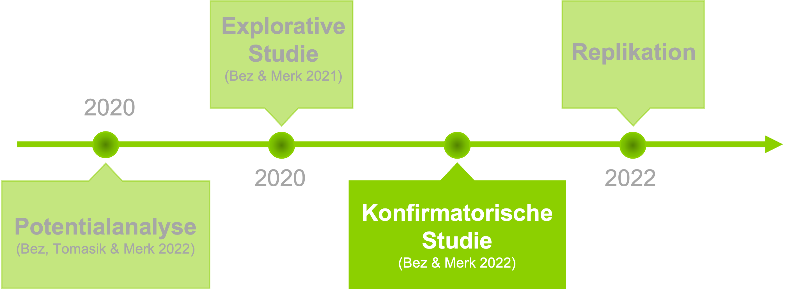
```


---
## Konfirmatorische Studie (RCT)
> .phgreenlight[Ziel: Verbesserung von Noticing und Interpreting durch innovative Darstellungen und eine Kurzzeit-Schulung]

---
## Konfirmatorische Studie (RCT)
### Materials
.pull-left[
```{r, echo = F, out.width="80%"}
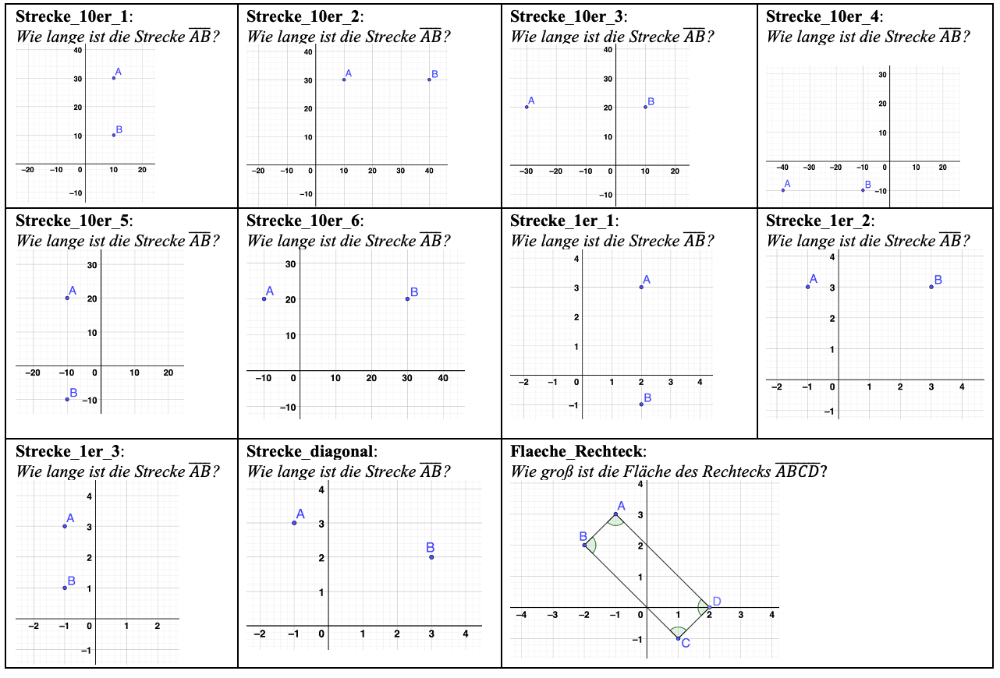
```
]

.pull-right[
```{r, echo = F, out.width="80%"}
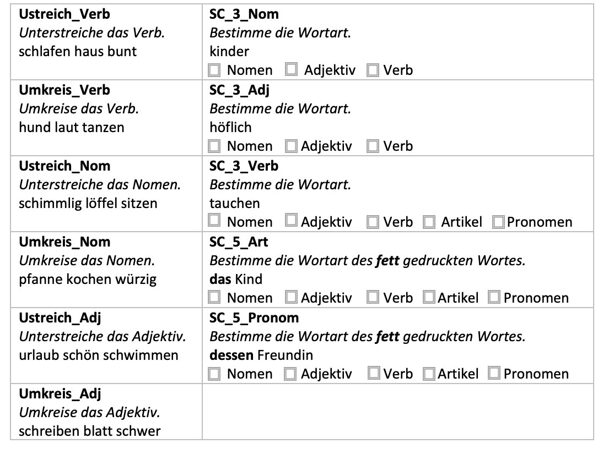
```
]


---
## Konfirmatorische Studie (RCT)
### Materials
.pull-left[

```{r, echo = F, out.width="90%", fig.align='center', message = F, warning = F, fig.retina=5, fig.height=5, fig.width=8}
library(viridis)
library(gplots)
data_dummy_tsheatmap <- read_excel("MWE_Data_1_von Sarah.xlsx")
data_heatmap <- data_dummy_tsheatmap%>%
  select(-PID)%>%
  sample_frac(size = 1)%>%
  as.matrix(., rownames.force = T)

row.names(data_heatmap) <- pull(data_dummy_tsheatmap, "PID")
data_rowmeans <- rowMeans(data_heatmap)
data_colmeans <- colMeans(data_heatmap)

cols <- viridis(100)
rowcols <- viridis(100)
colcols <- viridis(100)
par(bg = 'black', col = "white", axis = "white", col.axis = "white")
heatmap.2(data_heatmap, scale = "none", col = viridis, 
          Rowv = T,
          Colv = T,
          dendrogram = "none",
          trace = "none", density.info = "none",
          RowSideColors = rowcols[round(data_rowmeans*100,0)],
          ColSideColors = colcols[round(data_colmeans*100,0)],
          key.title = NA,
          key.xlab = "Anteil korrekter Lösungen\npro Aufgabe/SchuelerIn",
          key.par = list(cex=.7),
          margins = c(8, 8))#,
          #distfun = function(c) as.dist(1 - c))


```
]

.pull-right[

```{r, echo = F, out.width="80%", fig.align='center', message = F}
library(readxl)
library(tidyverse)
library(gplots)
library(RColorBrewer)
library(viridis)
library(reactable)

data_dummy_tsheatmap <- read_excel("MWE_Data_1_von Sarah.xlsx")

options(reactable.theme = reactableTheme(
  color = "hsl(233, 9%, 87%)",
  backgroundColor = "hsl(233, 9%, 19%)",
  borderColor = "hsl(233, 9%, 22%)",
  stripedColor = "hsl(233, 12%, 22%)",
  highlightColor = "hsl(233, 12%, 24%)",
  inputStyle = list(backgroundColor = "hsl(233, 9%, 25%)"),
  selectStyle = list(backgroundColor = "hsl(233, 9%, 25%)"),
  pageButtonHoverStyle = list(backgroundColor = "hsl(233, 9%, 25%)"),
  pageButtonActiveStyle = list(backgroundColor = "hsl(233, 9%, 28%)")
))

reactable(
  data_dummy_tsheatmap,
  columns = list(
    PID = colDef(minWidth = 150)),
  resizable = TRUE,
  wrap = FALSE,
  showPageSizeOptions = TRUE,
  striped = TRUE,
  highlight = TRUE,
  defaultPageSize = 6
)
```
]


---
## Konfirmatorische Studie (RCT)
### Design
```{r, echo = F, out.width="70%", fig.align='center', fig.cap="Design der Konfirmatorischen Studie"}
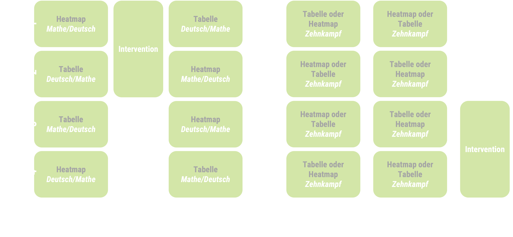
```


---
## Konfirmatorische Studie (RCT)
### Abhängige Variablen:

AV1: Akkuratheit
* Wie gut stimmen von Lehrkräften gebildete homogene (Lern-)Gruppen mit algorithmischen Lösungen überein?
        
AV2: Effektivität
* Wie lange brauchen Lehrkräfte um auf ihre korrekte Lösung zu kommen?

AV3: Diagnostische Differenziertheit
* Erkennen Lehrkräfte 
    * Curriculare Subkomponenten und
    * Aufgabenformatartefakte?
    

---
## Konfirmatorische Studie (RCT)
### Ergebnisse: Akkuratheit
.pull-left[
```{r, echo = F, out.width="100%"}
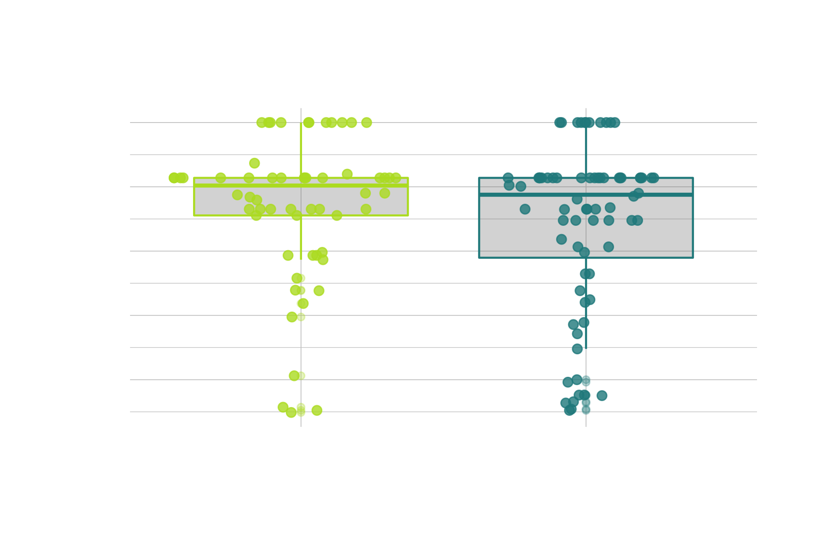
```
]

.pull-right[
```{r, echo = F, out.width="100%"}
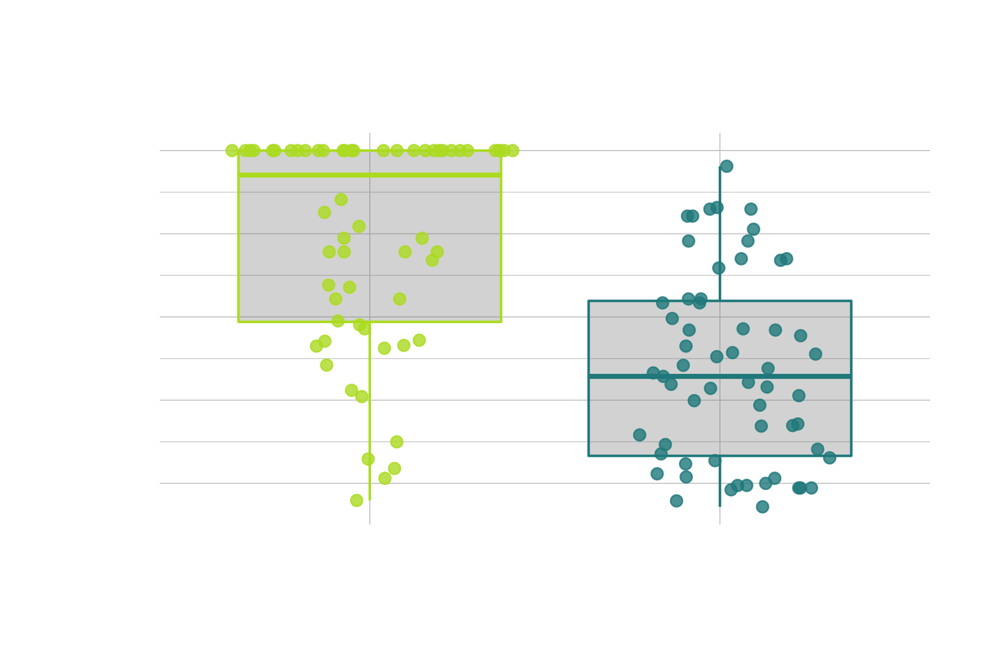
```
]


---
## Konfirmatorische Studie (RCT)
### Ergebnisse: Effizienz
.pull-left[
```{r, echo = F, out.width="100%"}
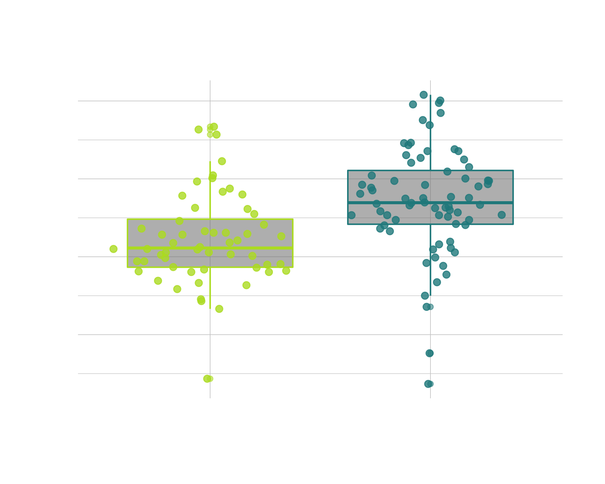
```
]

.pull-right[
```{r, echo = F, out.width="100%"}
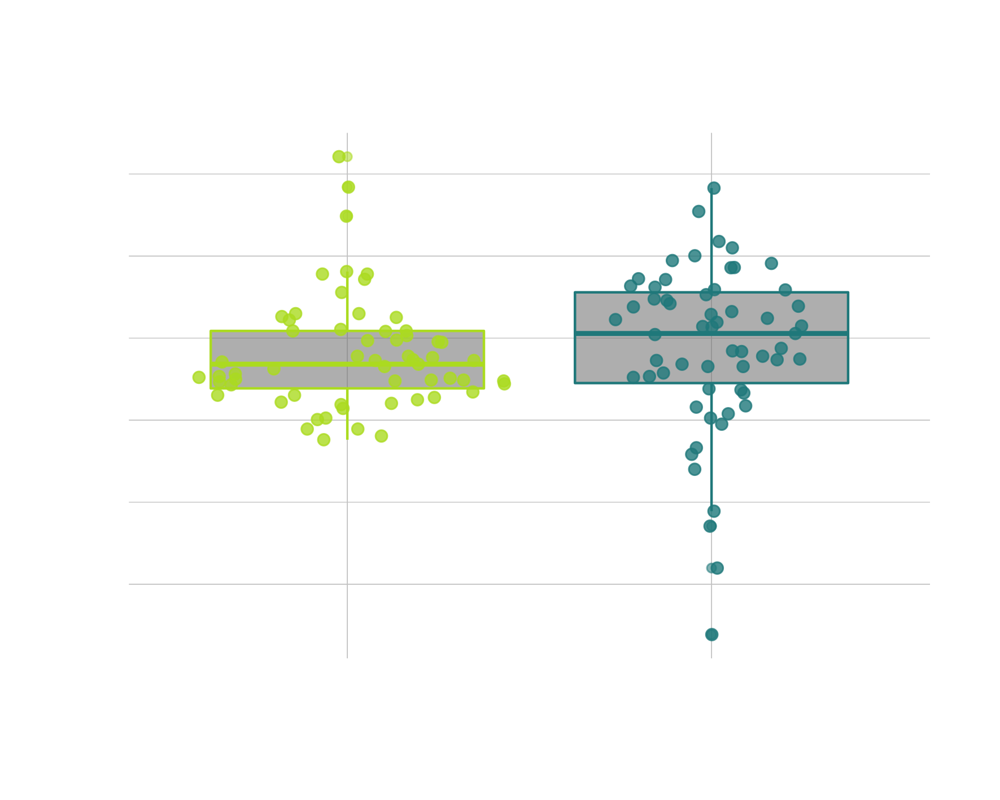
```
]


---
class: center, middle, hide_logo
background-image: url(https://imagizer.imageshack.com/img924/1061/buQNhG.png)
background-size: cover
# Herzlichen Dank für Ihre Aufmerksamkeit!

